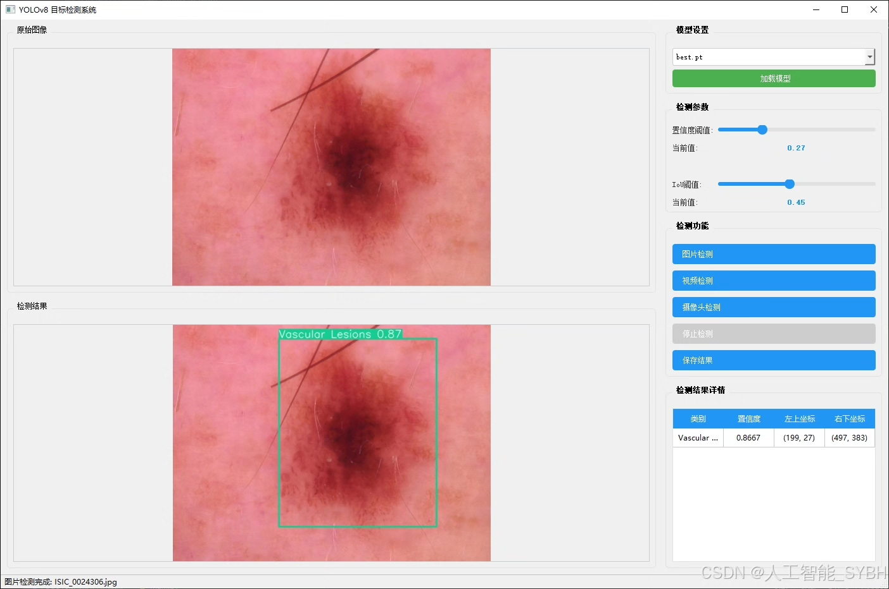
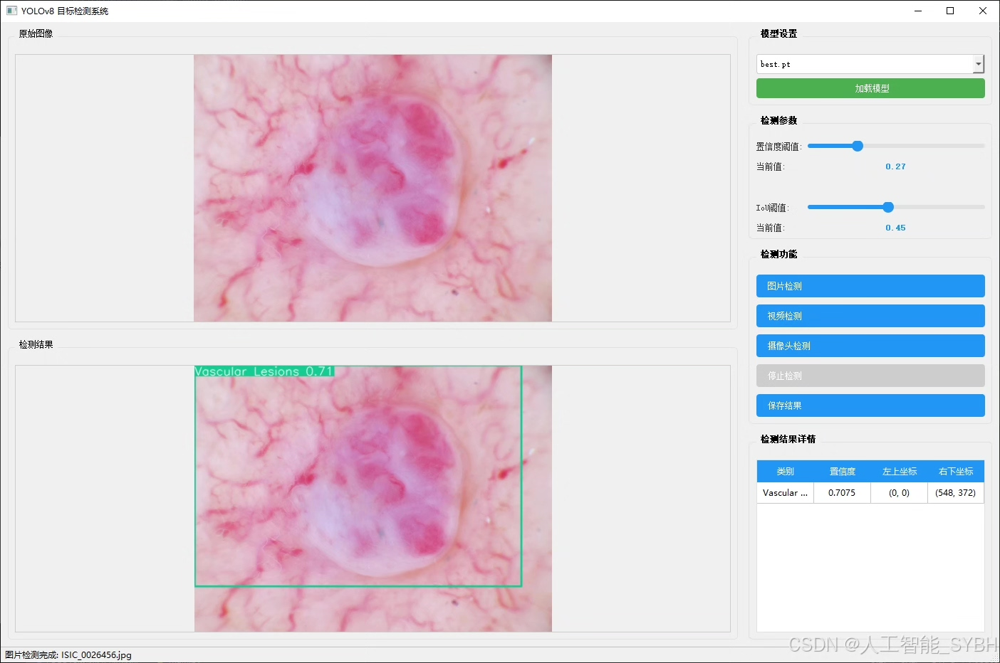
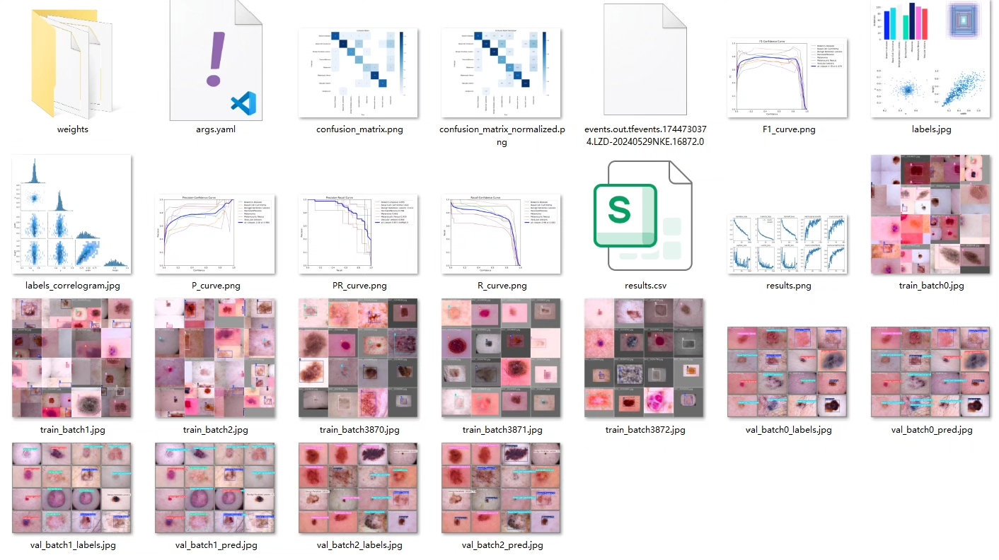
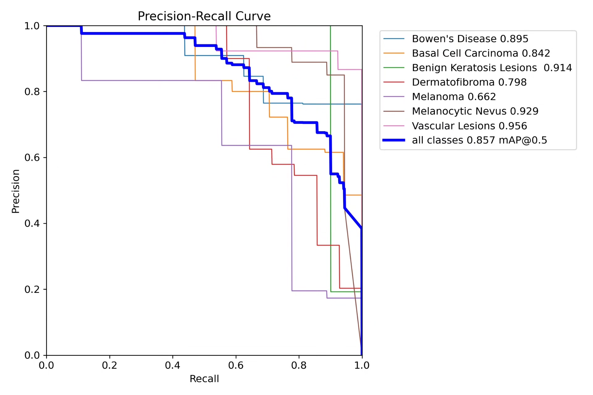
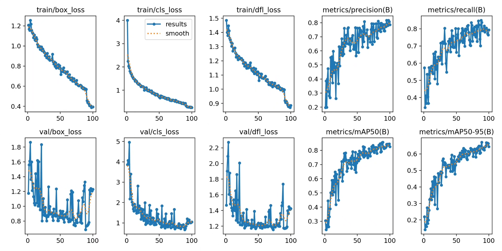
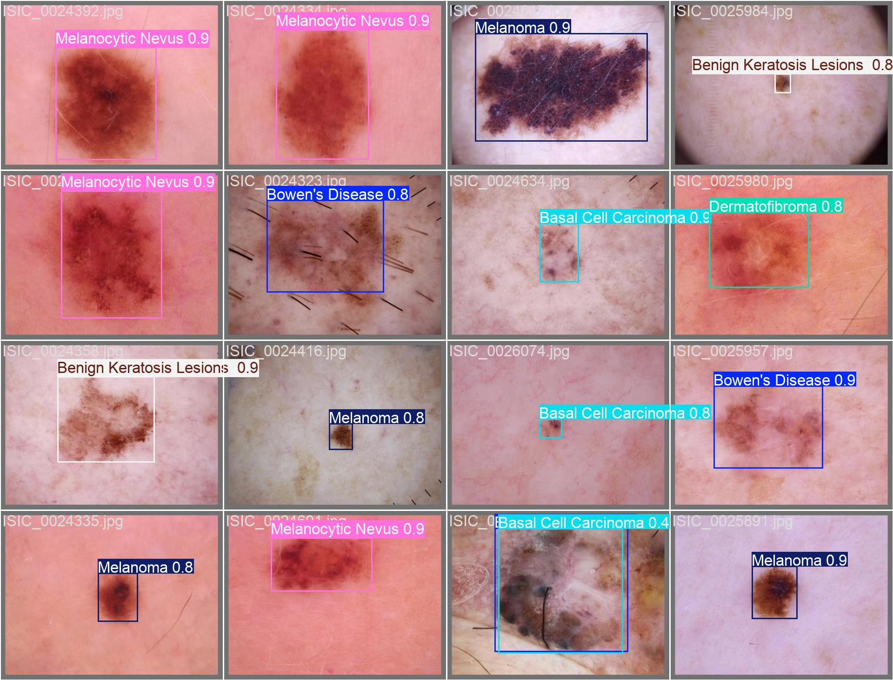
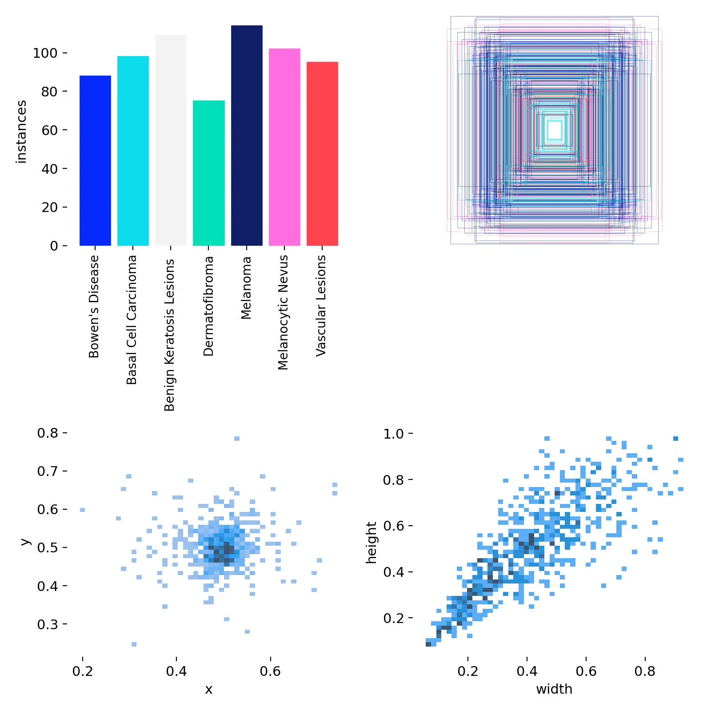
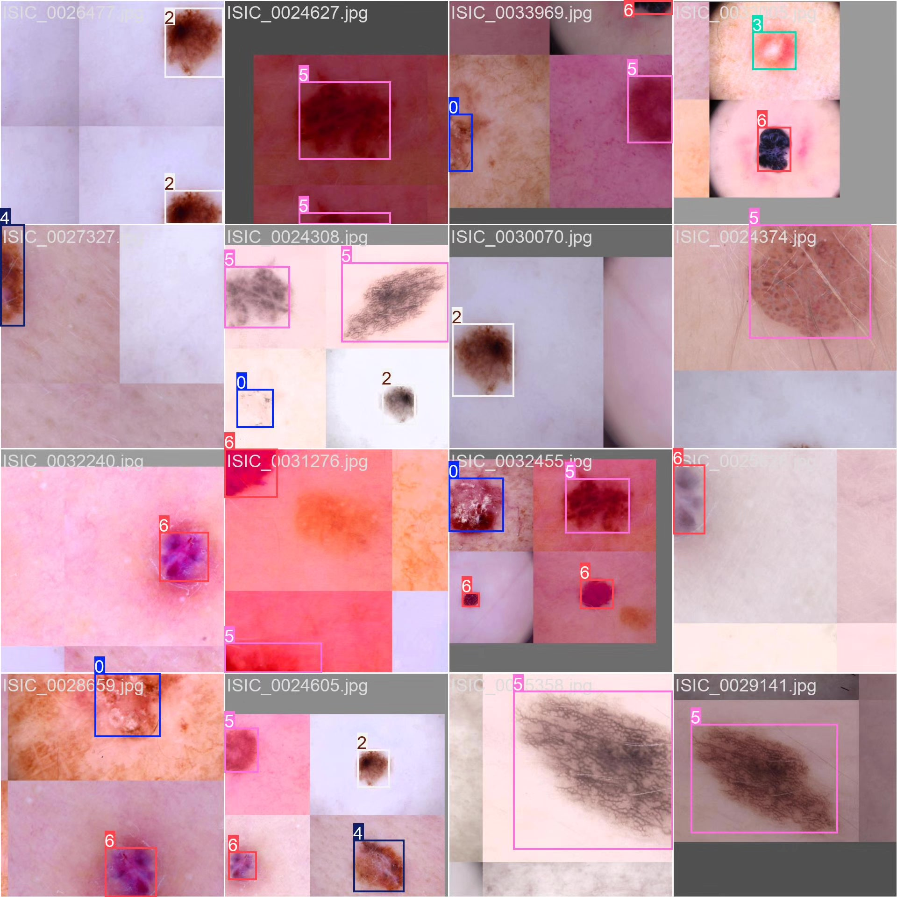

# Based on YOLOv8 deep learning for the detection of skin diseases (YOLOv8+YO)

## Body

Based on the YOLOv8 deep learning algorithm, this project has developed a skin disease automatic recognition system, specifically for detecting and classifying seven common skin lesions. The training dataset of the system includes 681 training images, 97 validation images, and 195 test images, covering seven types of skin diseases such as Bowen's Disease (Bowen's Disease), Basal Cell Carcinoma (Basal Cell Carcinoma), Benign Keratosis Lesions (Benign Keratosis Lesions), Dermatofibroma (Dermatofibroma), Melanocytic Nevus (Melanocytic Nevus), and Vascular Lesions (Vascular Lesions). Through deep learning technology, this system can quickly and accurately identify the type of skin lesion, providing an assistive tool for early screening and diagnosis of skin diseases. Experimental results show that the system achieves high recognition accuracy on the test set, with good clinical application potential.

The company's products have obtained the official commercial license certification from YOLO.

We provide after-sales service.

After payment, we will provide WeChat ID to answer questions at any time.

Environment configuration: We will provide a tutorial on environment configuration, and WeChat will provide answers.

Remote installation service: If you need remote configuration, an additional fee of 69 is required,
failure in configuration, all fees are refunded (specially for old computers only refund installation fees)

Retraining dataset: After setting up the environment, you can train on your own computer.
If you need us to retrain, just pay 69+ computing power fees (2.5 yuan/hour)

## Images

## Payment

Here is a pay link on Stripe ( https://buy.stripe.com/3cs8yP7sY87d0vu9AB ). Please contact me lonlonago@foxmail.com after funding $89, and I will send you a complete data files , thank you!

